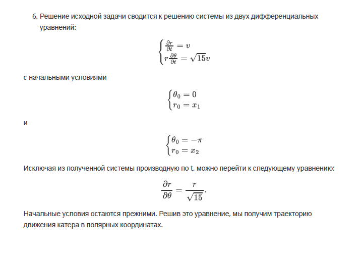
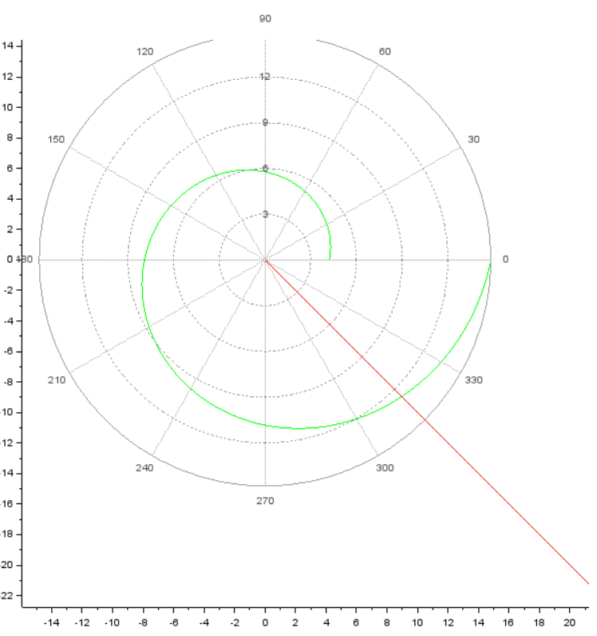
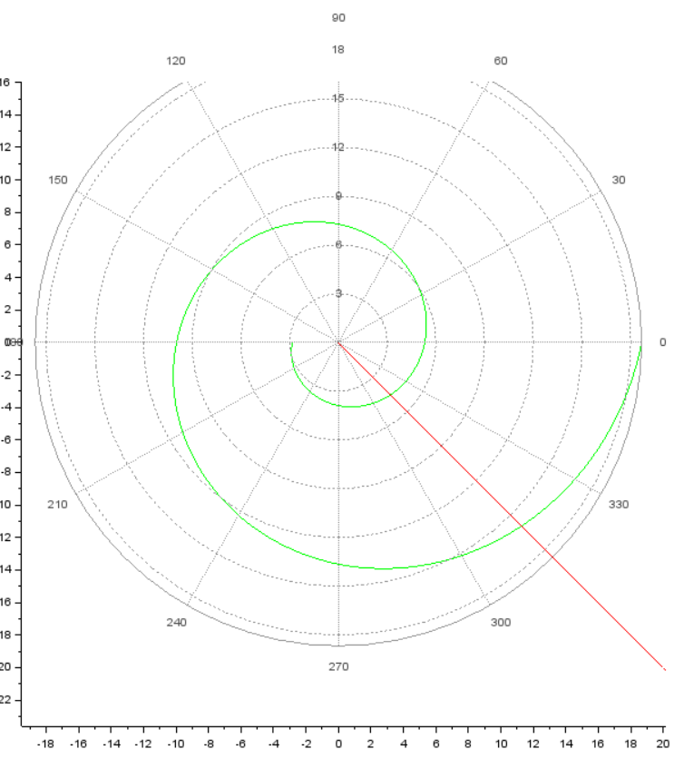

# Лабораторная работа №2
## Смирнов Артем
### RUDN University, 2022 Moscow, Russia

---

<!--_class: titleslide1 -->
#### Прагматика выполнения лабораторной работы
* Изучение основ математического моделирования.
* Изучение визуализации уравнений движения.

---

<!--_class: titleslide2 -->
#### Цель выполнения лабораторной работы
* Изучить как рещать задачи погони.
* Изучить визуализацию подобных задач.
* Научиться выводить уравнения движения.

---

<!--_class: titleslide3 -->
#### Задача выполнения лабораторной работы

* Вывести уравнение, которое описывает движение катера, с начальными условиями, которые описывают два случая.

* Построить трактории движения в двух случая.

* Найти точки пересечения траекторий в двух случаях.

---
<!--_class: titleslide4 -->
#### Уравнение движения

#  

---

<!--_class: titleslide5 -->
#### Результат в первом случае

# 

---

<!--_class: titleslide6 -->
#### Результат во втором случае

# 
