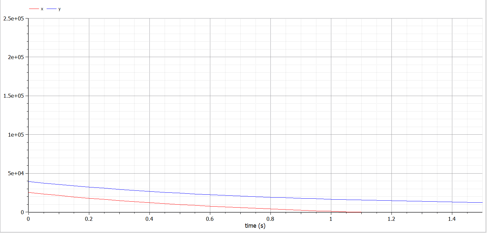
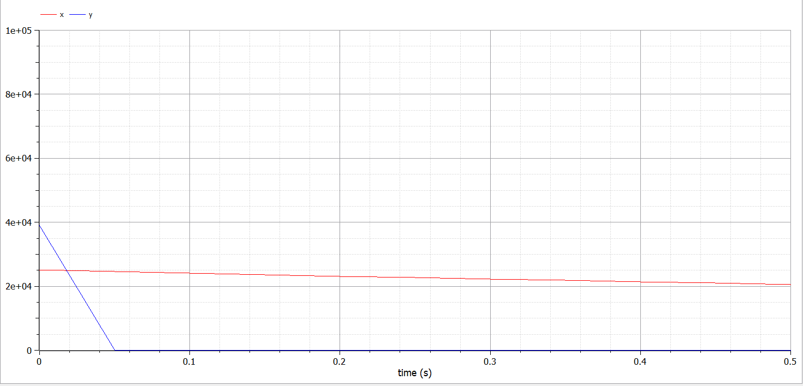

# Лабораторная работа №3
## Смирнов Артем Александрович
### RUDN University, 2022 Moscow, Russia

---
<!--_class: titleslide1 -->
#### Прагматика выполнения лабораторной работы
* Модель Ланчестера применяется в военном деле для расчета военных потерь.
* Данная модель может использоваться во всех конфликтных ситуациях, заключающихся в противоборстве двух сторон.

---
<!--_class: titleslide2 -->
#### Цель выполнения лабораторной работы
* Рассмотреть простейшую модель боевых действий - модель Ланчестера.
* Научиться составлять системы дифференциальных уравнений изменения численностей армии.
* Научиться строить графики для моделей боевых действий.

---
<!--_class: titleslide3 -->
#### Задача выполнения лабораторной работы

* Построить графики изменения численности армии для двух случаев:

    1. Военные действия между двумя рергулярными войсками.
    2. Военные действия между регулярным войском и партизанами.

---
<!--_class: titleslide4 -->
#### Результат выполнения - cлучай 1

#  

---
<!--_class: titleslide4 -->
#### Результат выполнения - cлучай 2

#  

---

<!--_class: titleslide3 -->
#### Вывод
*  Научился строить простые модели
*  Научился строить графики моделей военных действий (численность армии)
*  Рассмотрел модель боевых действий - модель Ланчествера
