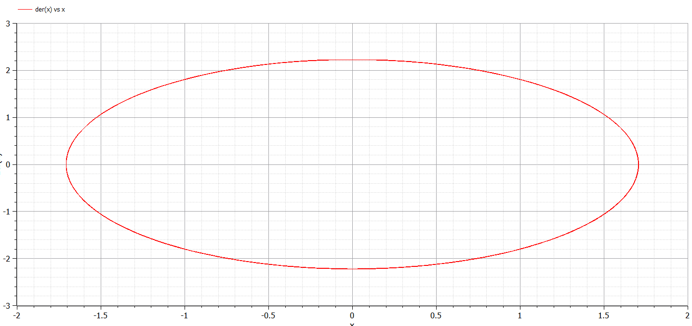
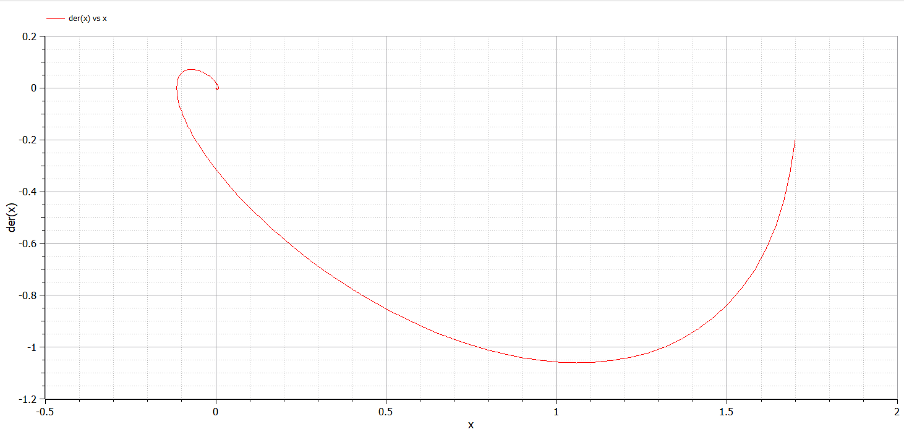

# Лабораторная работа №4
## Smirnov Artem
### RUDN University, 2022 Moscow, Russia

---
<!--_class: titleslide1 -->
#### Прагматика выполнения лабораторной работы
* Очень часто малые колебания, как свободные, так и вынужденные, которые происходят в реальных системах, можно считать имеющими форму гармонических колебаний или очень близкую к ней.

* Широкий класс периодических функций может быть разложен в ряд Фурье.

* Для широкого класса систем откликом на гармоническое воздействие является гармоническое колебание (свойство линейности). С учётом предыдущего свойства это позволяет исследовать прохождение колебаний произвольной формы через системы.

---
<!--_class: titleslide2 -->
#### Цель выполнения лабораторной работы
* Построить фазовый портрет гармонического осциллятора;
* Решить уравнения гармонического осциллятора.
* Научиться решать и моделировать уравнения гармонического осциллятора.

---
<!--_class: titleslide3 -->
#### Задача выполнения лабораторной работы

* Научиться переходить от дифференциального уравнения второго порядка к двум дифференциальным уравнениям первого порядка.

* Остроить фазовый портрет гармонического осциллятора и решить уравнения гармонического осциллятора для следующих случаев:

  - Колебания гармонического осциллятора без затуханий и без действий внешней силы
  - Колебания гармонического осциллятора c затуханием и без действий внешней силы
  - Колебания гармонического осциллятора c затуханием и под действием внешней силы
  - На заданном интервале с заданными начальными условиями.

---
<!--_class: titleslide4 -->
#### Фазовые портреты - cлучай 1

#  

---
<!--_class: titleslide4 -->
#### Фазовые портреты - cлучай 2

#  

---
<!--_class: titleslide4 -->
#### Фазовые портреты - cлучай 3

#  
---

<!--_class: titleslide1 -->
#### Вывод
Освоил фазовый портрет гармонического осциллятора и решил уравнения гармонического осциллятора:

1. Колебания гармонического осциллятора без затуханий и без действий внешней силы.
2. Колебания гармонического осциллятора c затуханием и без действий внешней силы.
3. Колебания гармонического осциллятора c затуханием и под действием внешней силы.