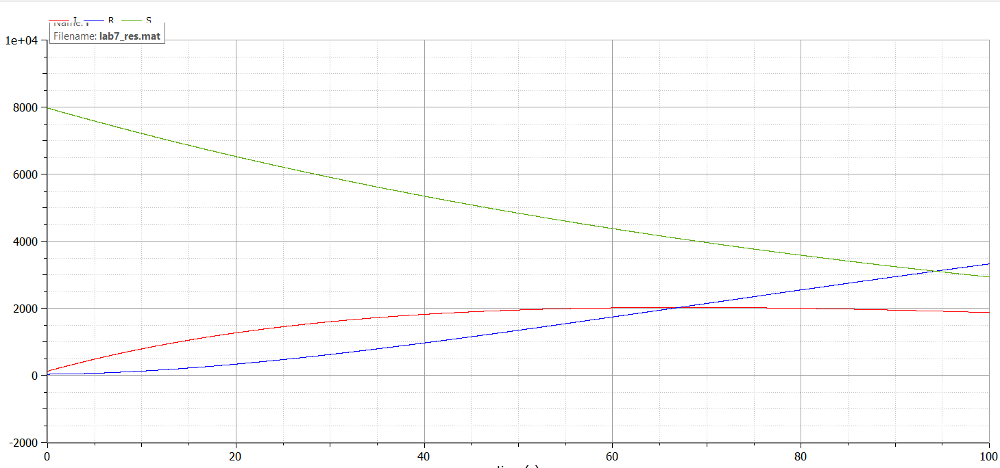
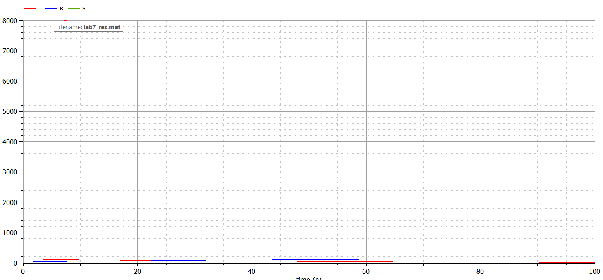

# Лабораторная работа №6
## Smirnov Artem
### RUDN University, 2022 Moscow, Russia

---
<!--_class: titleslide1 -->
#### Прагматика выполнения лабораторной работы

* Простешая модель эпидемии используется для моделирования распространения инфекционных заболеваний;

* Данная модель позволяет понять суть распространения эпидемии;

* Данная модель активно применяется для прогноза распространения коронавирусной инфекции;

---
<!--_class: titleslide2 -->
#### Цель выполнения лабораторной работы

Рассмотреть простейшую модель распространения болезней.

---
<!--_class: titleslide2 -->
#### Задача выполнения лабораторной работы

* Нужно построить графики изменения числа особей в каждой из трех групп при помощи простейшей модели эпидемии.
* Рассмотреть течение эпидемии в двух случаях.
---

<!--_class: titleslide4 -->
#### I(t) > I*. Инфицированные способны заражать восприимчивых к болезни особей

#  

---
<!--_class: titleslide4 -->
#### I(t) <= I*. Больные в изоляции и не способны заражать восприимчивых к болезни особей

#  
---

<!--_class: titleslide2 -->
#### Вывод

* Построил графики изменения числа особей в каждой из трех групп при помощи простейшей модели эпидемии.
* Рассмотрел течение эпидемии в двух случаях.

---
# Спасибо за внимание